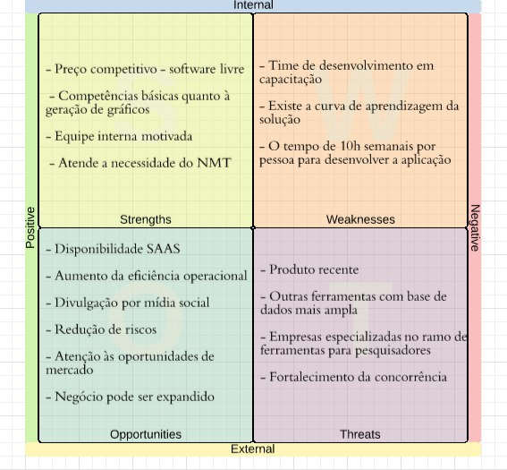

# Análise SWOT

## Sobre a Análise SWOT

A análise SWOT, segundo o SEBRAE, serve para analisar os pontos fortes e fracos, e as oportunidades e ameaças de um negócio. Assim, o empreendedor pode organizar um plano de ação para reduzir os riscos e aumentar as chances de sucesso da empresa.
É útil porque incentiva o empreendedor a analisar sua empresa sob diversas perspectivas de forma simples, objetiva e propositiva.

## Análise SWOT no contexto do Observ

### Pontos Fortes (análise interna)
 - Preço competitivo - software livre
 - Competências básicas quanto à geração de gráficos
 - Equipe interna motivada
 - Atende a necessidade do NMT

### Pontos Fracos (análise interna)
- Time de desenvolvimento em capacitação
- Existe a curva de aprendizagem da solução
- O tempo de 10h semanais por pessoa para desenvolver a aplicação

### Ameaças (análise externa)
- Produto recente
- Outras ferramentas com base de dados mais ampla
- Empresas especializadas no ramo de ferramentas para pesquisadores
- Fortalecimento da concorrência

### Oportunidades (análise externa)
- Disponibilidade SAAS
- Aumento da eficiência operacional
- Divulgação por mídia social
- Redução de riscos
- Atenção às oportunidades de mercado
- Negócio pode ser expandido

Figura 1 - Análise SWOT para o negócio do produto Observ.

## Referências

[SEBRAE](http://www.sebrae.com.br/Sebrae/Portal%20Sebrae/Anexos/ME_Analise-Swot.PDF)
