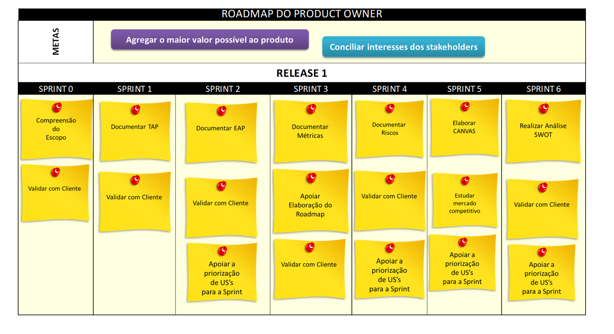

# ROADMAP dos Papéis
Este documento apresenta os Roadmaps com as responsabilidades e funções desempenhadas por cada integrante de acordo com a metodologia adotada. As responsabilidades estão segmentadas de acordo com certos intervalos para auxiliar a equipe em uma eventual troca de papéis.

## Product Owner

A seguir, um breve detalhamento das atividades práticas de um Product Owner no projeto Tropical Hazards BI. A primeira figura detalha o período até a Release 1, datada para 19/04/2018, seguida da figurada referente ao período entre Release 1 e a Release 2.

Figura 1 - Atividades de Product Owner até a Release 1.

Figura 2 - Atividades de Product Owner até a Release 2.

## Arquiteto de Software
Esta seção apresenta as responsabilidades e funções do arquiteto de software do sistema, detalhando as atividades necessárias para o integrante que for desempenhar este papel.

## Scrum Master
Define atividades, responsabilidades e objetivos do Scrum Master visando maximizar a produtividade e mitigar os riscos enfretados pela equipe.

## Designer
O papel de _designer_, dentro do projeto funciona de maneira diferenciada em relação aos outros papéis. Assim como o ciclo do _Scrum_, o ciclo de design é empírico, visando a experimentação de seus produtos e evoluindo-os continuamente. O papel de designer também funciona como um _Wild Card_ dentro do projeto.
Abaixo as principais funções do papel de designer no projeto.

Roadmap:

## Dev-Ops
Uma breve descrição das tarefas desguiadas ao papel do Dev-ops:

 
